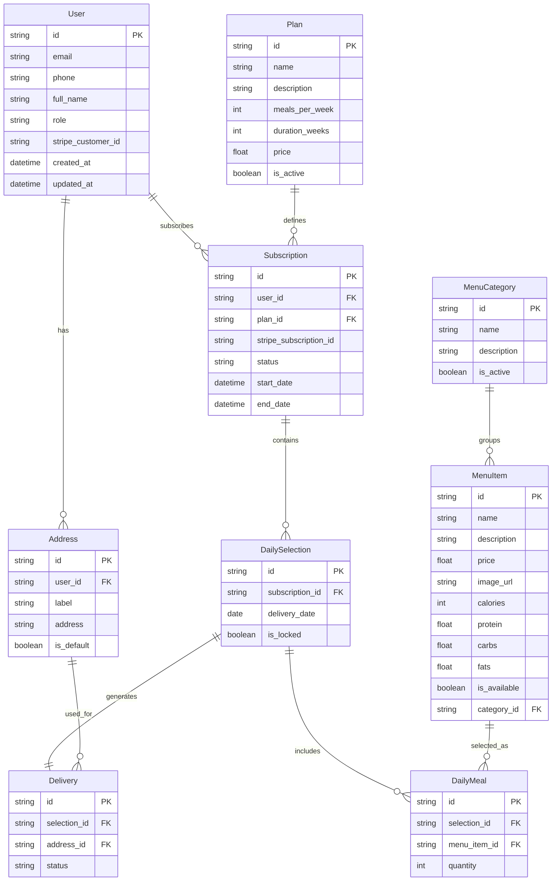

# 🗄️ DATABASE SCHEMA (PRISMA)

```prisma
model User {
  id          String   @id
  email       String?  @unique
  phone       String?  @unique
  fullName    String?
  role        Role     @default(CUSTOMER)

  stripeCustomerId String?

  createdAt   DateTime @default(now())
  updatedAt   DateTime @updatedAt

  addresses      Address[]
  subscriptions  Subscription[]
}

// ----------------------

enum Role {
  SUPER_ADMIN
  ADMIN
  CUSTOMER
}

// ----------------------

model Address {
  id        String  @id @default(uuid())
  userId    String
  label     String?
  address   String
  isDefault Boolean @default(false)

  user User @relation(fields: [userId], references: [id])
}

// ----------------------

model MenuCategory {
  id          String  @id @default(uuid())
  name        String
  description String?
  isActive    Boolean @default(true)

  items MenuItem[]
}

// ----------------------

model MenuItem {
  id          String   @id @default(uuid())
  name        String
  description String?
  price       Float
  imageUrl    String?

  calories    Int?
  protein     Float?
  carbs       Float?
  fats        Float?

  isAvailable Boolean @default(true)

  categoryId String?
  category   MenuCategory? @relation(fields: [categoryId], references: [id])

  createdAt DateTime @default(now())
}

// ----------------------

model Plan {
  id            String  @id @default(uuid())
  name          String
  description   String?
  mealsPerWeek  Int
  durationWeeks Int
  price         Float
  isActive      Boolean @default(true)

  subscriptions Subscription[]
}

// ----------------------

model Subscription {
  id        String   @id @default(uuid())
  userId    String
  planId    String

  stripeSubscriptionId String?

  status    SubscriptionStatus
  startDate DateTime
  endDate   DateTime?

  user User @relation(fields: [userId], references: [id])
  plan Plan @relation(fields: [planId], references: [id])

  selections DailySelection[]
}

// ----------------------

model DailySelection {
  id             String   @id @default(uuid())
  subscriptionId String

  deliveryDate   DateTime
  isLocked       Boolean  @default(false)

  subscription Subscription @relation(fields: [subscriptionId], references: [id])
  meals        DailyMeal[]
  delivery     Delivery?
}

// ----------------------

model DailyMeal {
  id            String @id @default(uuid())
  selectionId   String
  menuItemId    String
  quantity      Int

  selection DailySelection @relation(fields: [selectionId], references: [id])
  menuItem  MenuItem       @relation(fields: [menuItemId], references: [id])
}

// ----------------------

model Delivery {
  id            String   @id @default(uuid())
  selectionId   String   @unique
  addressId     String

  status        DeliveryStatus

  selection DailySelection @relation(fields: [selectionId], references: [id])
  address   Address        @relation(fields: [addressId], references: [id])
}

// ----------------------

enum SubscriptionStatus {
  ACTIVE
  CANCELLED
}

// ----------------------

enum DeliveryStatus {
  PENDING
  PREPARING
  OUT_FOR_DELIVERY
  DELIVERED
}
```

