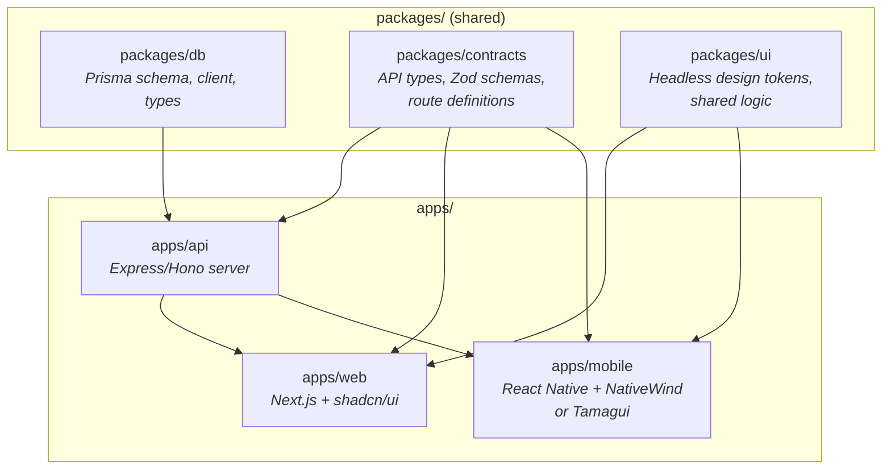

```mermaid
graph TD
    subgraph "packages/ (shared)"
        DB["packages/db<br/><i>Prisma schema, client, types</i>"]
        CONTRACTS["packages/contracts<br/><i>API types, Zod schemas,<br/>route definitions</i>"]
        UI["packages/ui<br/><i>Headless design tokens,<br/>shared logic</i>"]
    end

    subgraph "apps/"
        WEB["apps/web<br/><i>Next.js + shadcn/ui</i>"]
        MOBILE["apps/mobile<br/><i>React Native + NativeWind<br/>or Tamagui</i>"]
        API["apps/api<br/><i>Express/Hono server</i>"]
    end

    DB --> API
    CONTRACTS --> API
    CONTRACTS --> WEB
    CONTRACTS --> MOBILE
    UI --> WEB
    UI --> MOBILE
    API --> WEB
    API --> MOBILE
```